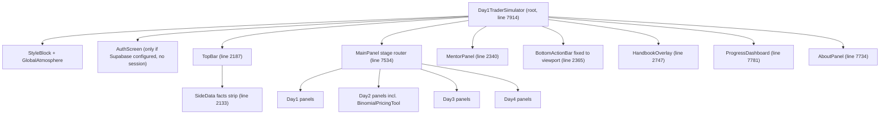

How the single-file app is structured: one root component, a stage state machine, and a panel router.

# Architecture

## The single-file constraint

All logic lives in `src/Day1TraderSimulator.jsx` (about 9225 lines). `src/main.jsx` only mounts it. The only other source file is `src/supabaseClient.js` (see [[Supabase Integration]]). CLAUDE.md says: do not split the file. Line numbers below are from the current main branch and drift over time; locate by name when editing.

## Render flow

The root component `Day1TraderSimulator` (line 7914) owns all state. The heart is a stage state machine: `currentStage` (line 7916) holds a string id like `day2_quote_slider`, and `MainPanel` (line 7534) maps every stage id to a panel component. `BottomActionBar` (line 2365) renders the stage-appropriate action buttons that advance the machine. Full stage list in [[Game Flow]].

## Navigation and history

- `stageHistory` (line 7938) records visited stages so the TopBar back button can step backwards.
- `dashboard` and `about` are special stages rendered outside `MainPanel` (lines 9116 and 9133); `stageBeforeDashboard` (line 7944) remembers where to return.
- `fullWidthStages` (line 1485) lists stages that drop the side column: tree explainer, compare-vanilla, Day3 market run, Day4 pricing.
- The action bar is pinned to the viewport bottom (commit ac74c31) so no scrolling is needed to confirm.

## Cross-cutting state

- `liveTheoretical` (line 7926), the calculator's latest theoretical price, feeds the Day2 quote scoring (see [[Scoring System]]).
- `day4ClientIndex` and `day4Results` drive the [[Day 4 Graduation Round]] client queue.
- `profile` and `progress` persist via [[Progress Persistence]].

## Constraints (from CLAUDE.md)

- Pricing engine functions and step counts are fixed: vanilla N=3, barrier N=4 (see [[CRR Binomial Model]]).
- No dividend yield q, a deliberate teaching simplification.
- Do not change `path` arrays ([[Market Paths]]) or scoring band numbers ([[Scoring System]]).

Full component inventory with line numbers: [[Component Map]].
