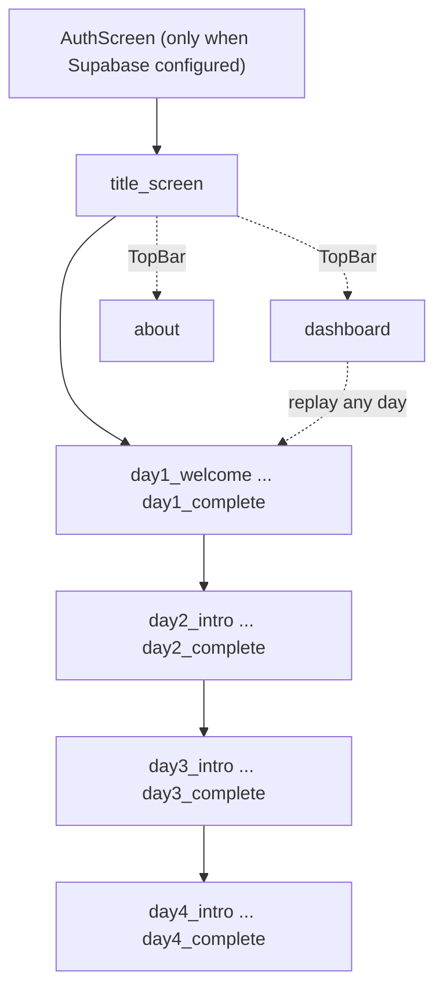

The stage state machine that drives the whole game, from title screen to graduation.

# Game Flow

The game is a linear state machine. `currentStage` (line 7916) holds a stage id; `MainPanel` (line 7534) renders the matching panel; `BottomActionBar` actions advance to the next stage and push the old one onto `stageHistory`. See [[Architecture]].

## Stage lists per day

Day 1 ([[Day 1 Vanilla Basics]]): `day1_welcome -> day1_lesson_basics -> day1_intro -> day1_lesson_premium -> day1_lesson_vanilla_rule -> day1_handbook_updated -> day1_client_arrival -> day1_product_selection -> day1_risk_disclosure -> day1_market_run -> day1_report -> day1_complete`

Day 2 ([[Day 2 Binomial Pricing]]): `day2_intro -> day2_lesson_pricing_anchor -> day2_lesson_tree_paths -> day2_lesson_backward_price -> day2_handbook_updated -> day2_research_terminal -> day2_client_arrival -> day2_product_review -> day2_tree_explainer -> day2_quote_slider -> day2_risk_disclosure -> day2_client_response -> day2_market_run -> day2_report -> day2_complete`

Day 3 ([[Day 3 Barrier Options]]): `day3_intro -> day3_lesson_barrier_concept -> day3_lesson_knock_out -> day3_handbook_updated -> day3_client_arrival -> day3_product_selection -> day3_research_terminal -> day3_lesson_compare_vanilla -> day3_risk_disclosure -> day3_client_response -> day3_market_run -> day3_report -> day3_complete`

Day 4 ([[Day 4 Graduation Round]]): `day4_intro -> (per client: day4_client_arrival -> day4_judge (client 3 only) -> day4_pricing -> day4_client_response) x3 -> day4_scorecard -> day4_complete`

## Special stages

- `title_screen` is the entry; `actions.startGame` calls `startDay1` (it was temporarily `startDay4` during testing, fixed in commit ad677ee).
- `dashboard` (line 9116) and `about` (line 9133) are reachable from the [[Component Map|TopBar]] at any time; `stageBeforeDashboard` restores the previous stage on close.
- The handbook is an overlay, not a stage, so it never disturbs the machine.

## Stage metadata

Every stage carries `label` (in-game clock like "09:20 Product Selection"), `system` (header tag), and `mentor` (the MentorPanel script). These live in `day1Config.stages` (line 4), `day2Config.stages` (line 283), `day3Config.stages` (line 597), and `day4Config` (line 1266).

Grading happens at the report stages via `evaluateDay1/2/3` and the Day4 scorecard, see [[Scoring System]].
